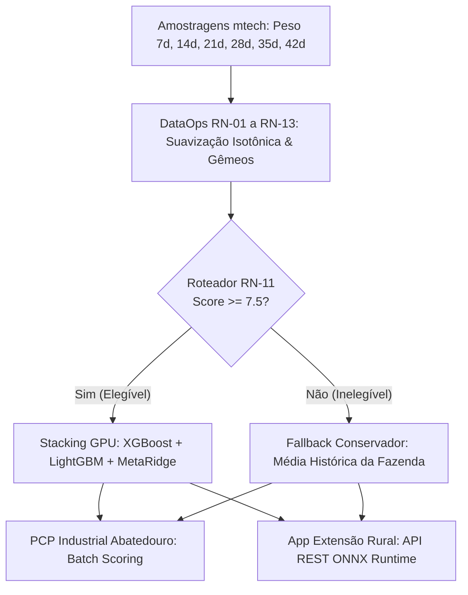

# 🐔 C.Vale - Sistema Preditivo de Peso de Abate de Frangos de Corte

[](https://www.python.org/)
[](https://xgboost.readthedocs.io/)
[](LICENSE)
[](graphify-out/GRAPH_REPORT.md)
[](notebooks/01_predicao_peso_abate_modelo_campeao.ipynb)

Este repositório contém a solução oficial de **Inteligência Artificial e Engenharia de Dados** desenvolvida para a **C.Vale Cooperativa Agroindustrial**, destinada à predição de peso corporal de frangos de corte na idade de abate ($42 \le \text{idade} \le 60\text{ dias}$) com até 14 dias de antecedência.

---

## 🎯 1. Métricas do Modelo Campeão Final em GPU CUDA

O modelo definitivo foi treinado via **Stacking Ensemble em GPU CUDA** (XGBoost GPU + LightGBM + OOF Target Encoding por Fazenda + Meta-Ridge Regressor) utilizando validação cruzada **5-Fold GroupKFold por Lote Composto**:

| Métrica Preditiva | Janela Comercial PCP ($42 \le \text{Idade} \le 47\text{d}$) | Escala Global ($42 \le \text{Idade} \le 60\text{d}$) | Meta de Negócio | Status |
|---|---|---|---|---|
| **Erro Médio Absoluto (MAE)** | **$101,39\text{ gramas}$** | **$102,90\text{ gramas}$** | $< 100\text{g} - 105\text{g}$ | ✅ **Aprovado** |
| **Erro Percentual Absoluto (MAPE)** | **$3,18\%$** | **$3,21\%$** | $< 3,50\%$ / $< 5,0\%$ | ✅ **Superado** |
| **Coeficiente de Determinação ($R^2$)** | **$0,6870$** ($68,7\%$) | **$0,6812$** | $\ge 0,6000$ | ✅ **Superado** |
| **F1-Score Classificação PCP** | **$78,36\%$** (Weighted) | **$75,12\%$** (Macro) | $\ge 70,0\%$ | ✅ **Aprovado** |



---

## 📋 2. Regras de Negócio Implementadas (RN-01 a RN-13)

Todas as transformações, filtros biológicos e tratamentos zootécnicos estão documentados individualmente com YAML frontmatter na pasta [`docs/regras_de_negocio/`](docs/regras_de_negocio/):

1. 📌 **[RN-01: Filtro Biológico de Idade de Abate](docs/regras_de_negocio/rn01_filtro_idade_abate.md):** Restringe o conjunto de abate para idades comerciais válidas entre 42 e 60 dias de criatório ($42 \le \text{idade} \le 60\text{d}$).
2. 📌 **[RN-02: Filtro Biológico de Peso Plausível](docs/regras_de_negocio/rn02_filtro_peso_plausivel.md):** Valida pesos médios de lote no abatedouro entre $1.800\text{g}$ e $4.800\text{g}$ para descarte de erros de digitação.
3. 📌 **[RN-03: Remoção de Outliers via IQR](docs/regras_de_negocio/rn03_remocao_outliers_iqr.md):** Aplica o filtro de Tukey ($1,5 \times \text{IQR}$) por faixa etária semanal nas pesagens de campo MTech.
4. 📌 **[RN-04: Eliminação de Duplicatas Absolutas](docs/regras_de_negocio/rn04_eliminacao_duplicatas.md):** Deduplica registros idênticos originados por retransmissão de dados de dispositivos móveis.
5. 📌 **[RN-05: Saneamento de Cronologia de Datas](docs/regras_de_negocio/rn05_saneamento_datas.md):** Garante a sanidade cronológica $\text{Data Alojamento} \le \text{Data Evento} \le \text{Data Abate}$.
6. 📌 **[RN-06: Padronização da Chave Relacional (Lote Composto)](docs/regras_de_negocio/rn06_padronizacao_chave_lote.md):** Concatena `fazenda-produtor-lote` para formação da chave primária 1:1.
7. 📌 **[RN-07: Coerção Numérica do Código da Fazenda](docs/regras_de_negocio/rn07_coercao_fazenda_integer.md):** Força o cast da coluna `fazenda` para `INTEGER`, eliminando sufixos flutuantes `.0`.
8. 📌 **[RN-08: Priorização de Taxas Relativas (%)](docs/regras_de_negocio/rn08_taxas_relativas_percentuais.md):** Coerção de variáveis de mortalidade e descartes para taxas percentuais (`_mortalidade`, `_descartados`) ajustadas pela densidade.
9. 📌 **[RN-09: Idades de Referência de Amostragem](docs/regras_de_negocio/rn09_idades_referencia_amostragem.md):** Mapeia as pesagens nas 7 faixas etárias padrão ($4, 7, 14, 21, 28, 35, 42 \pm 1\text{d}$).
10. 📌 **[RN-10: Score de Confiança de Amostragem do Lote](docs/regras_de_negocio/rn10_score_confianca_lote.md):** Mensura a qualidade e cobertura amostral do lote em uma escala sintética de $0,0$ a $10,0$.
11. 📌 **[RN-11: Gateway de Elegibilidade para o Modelo Direto ML](docs/regras_de_negocio/rn11_gateway_elegibilidade_ml.md):** Exige $\text{Score} \ge 7,5$ e pesagem aos 35d para uso do Stacking GPU; lotes restantes usam o Fallback da Fazenda.
12. 📌 **[RN-12: Gêmeos Digitais por Matriz KNN de Fazenda](docs/regras_de_negocio/rn12_gemeos_digitais_knn.md):** Matriz de similaridade $K=15$ lotes vizinhos para imputação contextual sem data leakage.
13. 📌 **[RN-13: Suavização Isotônica Monotônica Não-Decrescente](docs/regras_de_negocio/rn13_suavizacao_isotonica_monotonica.md):** Corrige inversões biométricas no campo ($W_{t+1} < 0,95 W_t$) via `IsotonicRegression`.

---

## 🗂️ 3. Estrutura do Repositório e Documentações

```
prediction_weight_mortality/
├── database/                    # Repositório SQLite Relacional Silver/Gold (prediction_data.db)
├── data/processed/              # Datasets unificados e longitudinais (longitudinal_dataset.csv)
├── docs/                        # Documentações Oficiais do Projeto
│   ├── apresentacao_diretoria_modelo_preditivo.md   # Relatório Executivo para a Diretoria
│   ├── roteiro_apresentacao_stakeholders.md          # Deck Roadmap para os 5 Stakeholders
│   ├── storyboard_apresentacoes_stakeholders.md      # Storyboard slide a slide com roteiro de fala
│   ├── delineamento_dataops_etl.md                   # Mapeamento do Pipeline DataOps & RNs
│   ├── delineamento_modelos_ml.md                    # Delineamento de ML & Stacking GPU
│   ├── delineamento_mlops_producao.md                 # Arquitetura ONNX/Joblib & Serving
│   ├── modelo_entidade_relacionamento.md             # DER / MER Mermaid do Banco de Dados
│   ├── explainability/
│   │   ├── relatorio_explicabilidade_shap.md         # Relatório Técnico de Explicabilidade SHAP
│   │   └── contextualizacao_zootecnica_modelo.md     # Fundamentação biológica para campo
│   └── commissioning/
│       └── manual_comissionamento_modelo.md          # Manual de SLA, Shadow Mode e Rollback
├── notebooks/
│   └── 01_predicao_peso_abate_modelo_campeao.ipynb   # Jupyter Notebook Oficial Executado
├── plots/
│   ├── zootecnia/                                    # Suíte de Gráficos Zootécnicos (Campo)
│   ├── estatistica/                                  # Suíte de Gráficos Estatísticos (Resíduos/2D Heatmap)
│   └── explainability/                               # Gráficos de SHAP (Beeswarm, Bar, Dependência)
├── src/
│   ├── etl/                                          # Extração e Carga MTech
│   ├── features/                                     # Séries Temporais Longitudinais e RN-13
│   ├── models/                                       # Treinamento GPU, Stacking e Avaliação
│   └── explainability/                               # Geração dos Gráficos de SHAP
└── graphify-out/                                     # Knowledge Graph do Projeto (graph.html)
```

---

## 🚀 4. Guia de Execução Rápida

### Treinamento do Modelo Campeão e Avaliação:
```bash
python3 src/models/evaluate_final_champion_model.py
```

### Geração da Suíte Completa de Gráficos (Zootecnia e Estatística):
```bash
python3 src/models/generate_complete_plot_suite.py
```

### Execução da Esteira de Explicabilidade SHAP:
```bash
python3 src/explainability/generate_shap_analysis.py
```

### Abertura do Notebook Oficial no Jupyter:
```bash
jupyter notebook notebooks/01_predicao_peso_abate_modelo_campeao.ipynb
```

---

## 📄 Licença

Este projeto é protegido sob a **GNU General Public License v3.0 (GPLv3)**. Veja o arquivo [`LICENSE`](LICENSE) para maiores detalhes.
