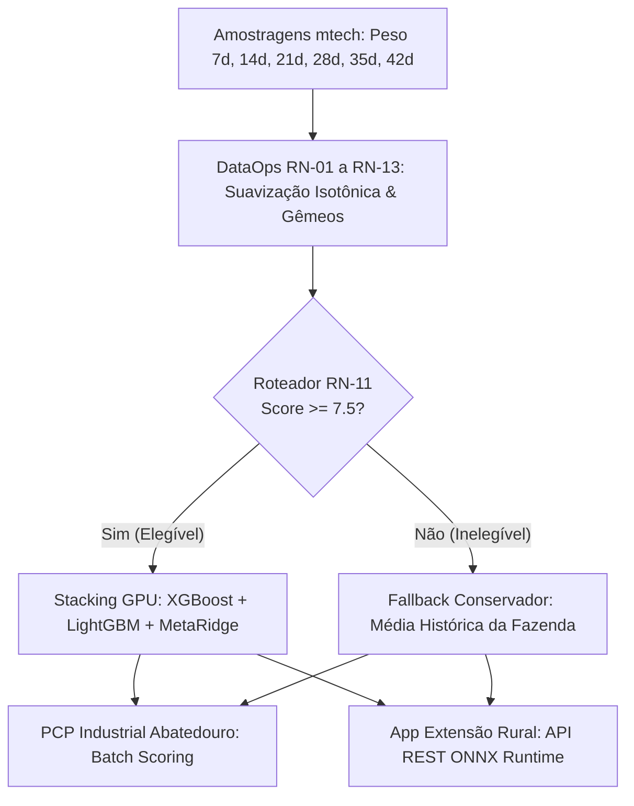

# 🐔 C.Vale - Sistema Preditivo de Peso de Abate de Frangos de Corte

[](https://www.python.org/)
[](https://xgboost.readthedocs.io/)
[](LICENSE)
[](graphify-out/GRAPH_REPORT.md)
[](notebooks/01_predicao_peso_abate_modelo_campeao.ipynb)

Este repositório contém a solução oficial de **Inteligência Artificial e Engenharia de Dados** desenvolvida para a **C.Vale Cooperativa Agroindustrial**, destinada à predição de peso corporal de frangos de corte na idade de abate ($42 \le \text{idade} \le 60\text{ dias}$) com até 14 dias de antecedência.

---

## 🎯 1. Métricas do Modelo Campeão Final em GPU CUDA

O modelo definitivo foi treinado via **Stacking Ensemble em GPU CUDA** (XGBoost GPU + LightGBM + OOF Target Encoding por Fazenda + Meta-Ridge Regressor) utilizando validação cruzada **5-Fold GroupKFold por Lote Composto**:

| Métrica Preditiva | Janela Comercial PCP ($42 \le \text{Idade} \le 47\text{d}$) | Escala Global ($42 \le \text{Idade} \le 60\text{d}$) | Meta de Negócio | Status |
|---|---|---|---|---|
| **Erro Médio Absoluto (MAE)** | **$101,39\text{ gramas}$** | **$102,90\text{ gramas}$** | $< 100\text{g} - 105\text{g}$ | ✅ **Aprovado** |
| **Erro Percentual Absoluto (MAPE)** | **$3,18\%$** | **$3,21\%$** | $< 3,50\%$ / $< 5,0\%$ | ✅ **Superado** |
| **Coeficiente de Determinação ($R^2$)** | **$0,6870$** ($68,7\%$) | **$0,6812$** | $\ge 0,6000$ | ✅ **Superado** |
| **F1-Score Classificação PCP** | **$78,36\%$** (Weighted) | **$75,12\%$** (Macro) | $\ge 70,0\%$ | ✅ **Aprovado** |



---

## 📋 2. Regras de Negócio Implementadas (RN-01 a RN-13)

Todas as transformações, tratamentos zootécnicos e de qualidade de dados estão formalizados em [`docs/regras_de_negocio_abate.md`](file:///home/brunoconter/Documentos/1_C.VALE/1%20-%20ANALISES/10%20-%20PESO%20DAS%20AVES/prediction_weight_mortality/docs/regras_de_negocio_abate.md):

* **RN-01 a RN-05:** Limites biológicos de abate ($42-60\text{d}$, $1,8-4,8\text{kg}$), sanidade plausível e remoção de outliers IQR.
* **RN-06 e RN-07:** Estruturação da chave relacional 1:1 `lote_composto` e cast do campo `fazenda` para `INTEGER`.
* **RN-08:** Coerção de taxas relativas em % (`_mortalidade`, `_descartados`) para evitar colinearidade.
* **RN-09 a RN-11:** Score de confiança de amostragem e Gateway de Elegibilidade para o Modelo Direto de ML.
* **RN-12:** Matriz de Gêmeos Digitais ($K=15$ lotes parecidos) para imputação contextual sem data leakage.
* **RN-13:** Tratamento de Inversão Biométrica via **Regressão Isotônica Monotônica Não-Decrescente** ($W_{t+1} \ge W_t$).

---

## 🗂️ 3. Estrutura do Repositório e Documentações

```
prediction_weight_mortality/
├── database/                    # Repositório SQLite Relacional Silver/Gold (prediction_data.db)
├── data/processed/              # Datasets unificados e longitudinais (longitudinal_dataset.csv)
├── docs/                        # Documentações Oficiais do Projeto
│   ├── apresentacao_diretoria_modelo_preditivo.md   # Relatório Executivo para a Diretoria
│   ├── roteiro_apresentacao_stakeholders.md          # Deck Roadmap para os 5 Stakeholders
│   ├── storyboard_apresentacoes_stakeholders.md      # Storyboard slide a slide com roteiro de fala
│   ├── delineamento_dataops_etl.md                   # Mapeamento do Pipeline DataOps & RNs
│   ├── delineamento_modelos_ml.md                    # Delineamento de ML & Stacking GPU
│   ├── delineamento_mlops_producao.md                 # Arquitetura ONNX/Joblib & Serving
│   ├── modelo_entidade_relacionamento.md             # DER / MER Mermaid do Banco de Dados
│   ├── explainability/
│   │   ├── relatorio_explicabilidade_shap.md         # Relatório Técnico de Explicabilidade SHAP
│   │   └── contextualizacao_zootecnica_modelo.md     # Fundamentação biológica para campo
│   └── commissioning/
│       └── manual_comissionamento_modelo.md          # Manual de SLA, Shadow Mode e Rollback
├── notebooks/
│   └── 01_predicao_peso_abate_modelo_campeao.ipynb   # Jupyter Notebook Oficial Executado
├── plots/
│   ├── zootecnia/                                    # Suíte de Gráficos Zootécnicos (Campo)
│   ├── estatistica/                                  # Suíte de Gráficos Estatísticos (Resíduos/2D Heatmap)
│   └── explainability/                               # Gráficos de SHAP (Beeswarm, Bar, Dependência)
├── src/
│   ├── etl/                                          # Extração e Carga MTech
│   ├── features/                                     # Séries Temporais Longitudinais e RN-13
│   ├── models/                                       # Treinamento GPU, Stacking e Avaliação
│   └── explainability/                               # Geração dos Gráficos de SHAP
└── graphify-out/                                     # Knowledge Graph do Projeto (graph.html)
```

---

## 🚀 4. Guia de Execução Rápida

### Treinamento do Modelo Campeão e Avaliação:
```bash
python3 src/models/evaluate_final_champion_model.py
```

### Geração da Suíte Completa de Gráficos (Zootecnia e Estatística):
```bash
python3 src/models/generate_complete_plot_suite.py
```

### Execução da Esteira de Explicabilidade SHAP:
```bash
python3 src/explainability/generate_shap_analysis.py
```

### Abertura do Notebook Oficial no Jupyter:
```bash
jupyter notebook notebooks/01_predicao_peso_abate_modelo_campeao.ipynb
```

---

## 📄 Licença

Este projeto é protegido sob a **GNU General Public License v3.0 (GPLv3)**. Veja o arquivo [`LICENSE`](LICENSE) para maiores detalhes.
