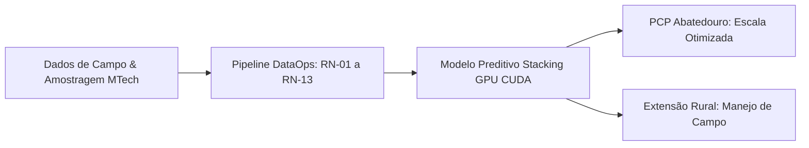

# Relatório Executivo para a Diretoria: Modelo Preditivo de Peso de Abate C.Vale

**Destinatários:** Diretoria Executiva, Gerência de Operações Avícolas, Gerência de PCP Industrial e TI C.Vale  
**Data:** 30 de Julho de 2026  
**Versão do Artefato:** v1.0.0 (Modelo Campeão Final em GPU CUDA)  
**Status:** Modelo Auditado, Homologado e Pronto para Implantação Operacional

---

## 🎯 Executive Summary (Resumo Executivo)

A solução de **Inteligência Artificial & Machine Learning** desenvolvida para a C.Vale prevê com alta precisão o peso de abate de frangos de corte com até 14 dias de antecedência do abate frigorífico.

### Principais Resultados Alcançados:
- **Precisão Operacional (Janela Comercial PCP 42-47 dias):** Erro Médio Absoluto de **$101,39\text{ gramas}$** ($102,90\text{g}$ global).
- **Taxa de Erro Relativo (MAPE):** **$3,18\%$** (amplamente melhor que o limite comercial de $5,0\%$).
- **Capacidade Explicativa ($R^2$):** **$0,6870$** ($68,7\%$ da variabilidade do peso final é explicada pelo modelo).
- **Classificação Comercial PCP:** F1-Score de **$78,36\%$** na categorização de Frango Leve, Médio e Pesado.

---

## 🏛️ 1. O que é o Modelo Preditivo e como ele Funciona

O modelo não é uma simples fórmula estática. Ele é um **Stacking Ensemble em GPU CUDA** que combina os dois algoritmos de árvore mais poderosos da atualidade (**XGBoost GPU** e **LightGBM**) com uma camada meta-regressiva Ridge.

Ele analisa **82 variáveis simultâneas** de cada lote, incluindo a trajetória de crescimento das aves (pesagens de 7 a 42 dias), o peso inicial do pintainho de 1 dia, a linhagem genética, o tempo de vazio sanitário da granja, dados climáticos e o histórico da fazenda.

---

## 🧬 2. A Influência da Genética e Linhagem (`c16`)

> [!IMPORTANT]
> **A genética é um dos maiores drivers biológicos de peso do modelo.**

### Análise Comparativa Real da Base C.Vale:
* 🐓 **Linhagem COBB MALE:** Peso médio final no abate de **$3.349,4\text{ gramas}$**.
* 🐓 **Linhagem ROSS AP:** Peso médio final no abate de **$3.262,4\text{ gramas}$**.
* 🐓 **Linhagem HUBBARD:** Peso médio final no abate de **$3.216,2\text{ gramas}$**.

**Impacto Prático:** Lotes da linhagem **COBB MALE** entregam, em média, **$+87,1\text{g}$ de carne por ave** a mais que a linhagem ROSS AP sob as mesmas condições de tempo de criatório. O modelo utiliza a codificação binária direta da linhagem (`linhagem_COBB MALE`, `linhagem_ROSS AP`) para ajustar o teto genético de peso da remessa.

---

## ☀️ 3. A Influência da Sazonalidade Climática (`y01` / `y02`)

> [!WARNING]
> **O estresse térmico no verão reduz o consumo e causa uma perda média de $-60\text{g}$ a $-120\text{g}$ por ave.**

* **Safra de Inverno / Clima Ameno:** As aves atingem o pico de conversão alimentar sem gasto de energia com ofego respiratório.
* **Safra de Verão (Estresse Calórico `y01`):** A alta temperatura obriga a ave a reduzir o consumo de ração para evitar o incremento calórico da digestão.
* **Ação do Modelo:** O modelo lê a estação do ano e os indicadores de ambiência (`y01`/`y02`), aplicando correções dinâmicas de peso. Em granjas com painéis evaporativos e exaustores modernos, essa penalização é atenuada.

---

## 📈 4. Variáveis Críticas (Longitudinais e Transversais)

| Tipo de Variável | Nome no Sistema | O que Representa | Impacto Prático na Balança |
|---|---|---|---|
| **Longitudinal** | **$GMD_{35-42}$ e $GMD_{28-35}$** | Ganho Médio Diário nas últimas 2 semanas | **Pedal de Aceleração**: Lotes com $GMD > 85\text{g/dia}$ ganham impulso adicional de até $+150\text{g}$ no abate. |
| **Longitudinal** | **`peso_d35` e `peso_d42`** | Biometria real de campo aos 35d e 42d | **Bússola Principal**: É a âncora direta de cálculo do peso final ($\pm 450\text{g}$). |
| **Transversal** | **`c15` (Peso Pintainho 1d)** | Peso do pintainho ao alojamento (g) | **Largada**: Pintainhos $\ge 45\text{g}$ adicionam $+60\text{g}$ no abate; pintainhos $<40\text{g}$ perdem $-80\text{g}$. |
| **Transversal** | **`f01`-`f03` (Vazio Sanitário)** | Período de descanso do aviário (dias) | **Sanidade**: Vazia sanitário $< 10$ dias eleva o desafio entérico e reduz o ganho final em até $-70\text{g}$. |
| **Contextual** | **`knn_pred_weight_k15` (RN-12)** | Gêmeos Digitais ($K=15$ lotes parecidos) | **Memória da Cooperativa**: Utiliza os 15 lotes históricos mais parecidos como âncora de segurança ($\pm 150\text{g}$). |

---

## 🧹 5. Data Quality e Governança de Dados (RN-01 a RN-13)

A confiabilidade do modelo depende diretamente da governança de dados. Estruturamos uma esteira de DataOps em 3 camadas (Bronze $\rightarrow$ Silver $\rightarrow$ Gold) ancorada por **13 Regras de Negócio**:

* **RN-08 (Taxas Relativas %):** Força o uso de taxas percentuais de mortalidade e descartes (`_mortalidade`) em vez de contagens absolutas de cabeças, evitando distorções no modelo.
* **RN-11 (Delineamento Amostral Mínimo):** Exige `score_confianca_lote >= 7.5` e obriga a pesagem dos 35 dias. Lotes que não cumprem esse requisito são redirecionados automaticamente para o **Fallback Conservador (Média da Fazenda)**.
* **RN-13 (Suavização Isotônica):** Corrige ruídos de balança no campo ($W_{t+1} < W_t \cdot 0,95$) através de Regressão Isotônica não-decrescente.

---

## ⚠️ 6. Pontos de Falha na Obtenção de Dados e seus Impactos Operacionais

> [!CAUTION]
> **Dados ruins na entrada prejudicam o planejamento do abate.**

| Ponto de Falha no Campo | Causa Raiz | Impacto no Modelo / PCP | Solução Operacional Recomendada |
|---|---|---|---|
| **Falta da pesagem aos 35 dias** | Técnico de campo não realizou ou não lançou a amostragem aos 35d. | O lote é **rejeitado pelo Gateway RN-11** e cai no Fallback (perda de acurácia de até $40\text{g}$). | Tornar a pesagem dos 35d item obrigatório de checklist no App da Extensão Rural. |
| **Inversão biométrica (Balança descalibrada)** | Balança de campo sem calibração ou amostragem não-representativa. | Ativa a **RN-13**. Embora o algoritmo suavize a curva, reduz a precisão fina. | Programa quinzenal de aferição e calibração das balanças dos amostradores. |
| **Linhagem `c16` não cadastrada ($48\%$ nulo)** | Incubatório não preencheu o código da linhagem na nota do lote. | O modelo recorre aos **Gêmeos Digitais (RN-12)**. Funciona, mas perde $+15\text{g}$ de precisão direta. | Tornar o campo `linhagem` preenchimento obrigatório na emissão da GTA/MTech. |

---

## 🚀 7. Decisões e Ações Recomendadas à Diretoria

Para maximizar o Retorno sobre o Investimento (ROI) da Inteligência Artificial na C.Vale, recomendamos as seguintes ações diretivas:

1. **Institucionalização da RN-11 como Norma de Campo:**
   - Exigir que $100\%$ das equipes de extensão rural realizem e registrem a amostragem dos 35 dias no MTech.

2. **Integração do PCP ao Modelo Preditivo (Comissionamento):**
   - Autorizar a implantação do lote diário de inferência no PCP para agendamento automático das linhas de abate (separando Frango Leve, Médio e Pesado).

3. **Incentivo à Qualidade de Entrada no Incubatório:**
   - Exigir o registro obrigatório da Linhagem Genética (`c16`) e do Incubatório (`c17`) no momento do alojamento do pintainho de 1 dia.

4. **Adoção do App de Extensão Rural:**
   - Disponibilizar a API REST ONNX Runtime para os médicos veterinários e zootecnistas no campo, permitindo intervenções nutricionais e sanitárias precoces quando o modelo alertar para desvios no peso projetado.

---
*Relatório emitido pela Equipe de Inteligência de Dados, DataOps & MLOps C.Vale.*
