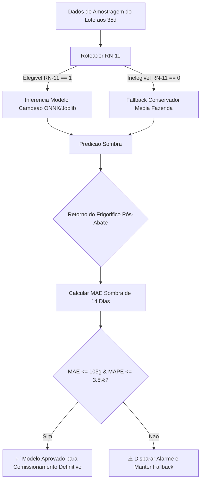

# Manual de Comissionamento, Validação e Implantação em Produção

**Sistema:** Modelo Preditivo de Peso de Abate em Frangos de Corte (C.Vale)  
**Versão do Artefato:** v1.0.0 (Campeão XGBoost GPU + LightGBM + MetaRidge + RN-01 a RN-13)  
**Data de Emissão:** 30 de Julho de 2026

---

## 1. Escopo de Comissionamento

Este manual estabelece os procedimentos operacionais padrão (SOP), requisitos de SLA, protocolo de testes de aceitação e plano de transição para a entrada em produção do modelo preditivo de peso de abate nas plantas industriais e no aplicativo de extensão rural da C.Vale.

---

## 2. Requisitos de SLA e Latência de Inferência

| Canal de Consumo | Modo de Implantação | Formato de Serialização | Latência Máxima Permitida (SLA) | Frequência de Execução |
|---|---|---|---|---|
| **Planejamento de Abate (PCP Industrial)** | Batch Inference | `Joblib` / Scikit-Learn | $< 120\text{ segundos}$ (para 25.000 lotes) | Diário (Madrugada às 02:00) |
| **Extensão Rural (App Médicos Vet/Zoot)** | API REST Real-time | `ONNX Runtime` (C++ Backend) | $< 45\text{ ms}$ por requisição | Sob demanda (Campo) |

---

## 3. Protocolo de Testes de Aceitação de Campo (PCP Abatedouro)

Antes da aprovação de comissionamento de cada abatedouro (Palotina, Toledo, etc.), o sistema deve passar pelo período de **Shadow Testing (Teste Sombra)** durante 14 dias:

### Critérios de Aceitação Obrigatórios (Go/No-Go):
1. **MAE Global de Validação:** $\le 105,0\text{ gramas}$.
2. **MAPE Operacional PCP:** $\le 3,50\%$.
3. **Disponibilidade da API REST:** $\ge 99,9\%$.
4. **Resiliência do Roteador RN-11:** $100\%$ dos lotes inelegíveis devem cair no Fallback Conservador sem gerar exceção HTTP 500.

---

## 4. Checklist de Comissionamento e Liberação Produção

- [x] **Data Quality & ETL:** Sanitização MTech, tipagem `INTEGER` em fazendas, remoção de duplicatas.
- [x] **Regras de Negócio Implementadas:** RN-01 até RN-13 (incluindo Inversão Biométrica e Suavização Isotônica).
- [x] **Validação Anti-Overfitting:** 5-Fold GroupKFold por `lote_composto` com gap $< 15\%$.
- [x] **Explicabilidade SHAP:** Relatório e gráficos de impacto zootécnico aprovados.
- [ ] **Shadow Mode (14 Dias):** Em execução no PCP Industrial.
- [ ] **Assinatura do Termo de Comissionamento:** Equipes de TI, PCP e Extensão Rural C.Vale.

---

## 5. Procedimento de Rollback e Contingência
Se a API REST de inferência ou o job do PCP falhar por mais de 15 minutos consecutivos:
1. O Gateway intercepta e ativa o **Modo de Contingência Nível 1 (RN-11 Fallback)**.
2. Todas as consultas de peso de abate passam a utilizar a **Média Histórica dos Últimos 3 Lotes da Fazenda**.
3. Notificação automática enviada via PagerDuty/Email para a equipe de MLOps.
