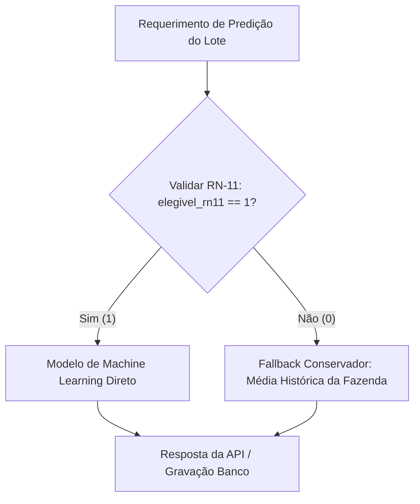

# Delineamento de MLOps, Governança e Arquitetura de Implantação

Este documento descreve a arquitetura de produção, estratégia de serving, roteamento de resiliência e governança do modelo de predição de peso de abate das aves.

## 1. Arquitetura de Implantação e Serving

A arquitetura foi desenhada para atender a dois perfis distintos de consumo:
*   **Inferência em Lote (Batch Processing):** Destinada ao Planejamento e Controle de Produção (PCP). Rotinas agendadas rodam as predições para todos os lotes que atingem os marcos temporais estabelecidos (ex: 35 dias), gravando os resultados em um banco de dados analítico ou Data Warehouse.
*   **API REST (Real-time/Near Real-time):** Destinada à equipe de extensão rural. Permite que técnicos no campo consultem, via aplicativo ou dashboard, a projeção atualizada de peso de lotes específicos sob demanda.

### Comparativo e Recomendação de Serialização (Joblib vs ONNX)

| Característica | Joblib | ONNX |
| :--- | :--- | :--- |
| **Integração Scikit-Learn / XGBoost** | Nativa e simples (Python) | Requer conversores (`skl2onnx`, `onnxmltools`) |
| **Ambiente de Execução** | Restrito ao ecossistema Python | Interoperável (C++, Java, Rust, Node, etc.) |
| **Otimização de Inferência** | Depende da implementação original | Alta otimização por hardware/compiladores via ONNX Runtime |
| **Latência (Tempo Real)** | Moderada | Baixa (Ideal para APIs e alta concorrência) |

**Recomendação:**
Para a esteira atual baseada em modelos de árvore (XGBoost, Random Forest), o **ONNX** é a recomendação para o serving da API REST devido à latência ultrabaixa e desacoplamento do ambiente Python restrito. O **Joblib** pode ser mantido para o processamento em lote (PCP), onde o ecossistema Python já está estabelecido e o tempo de conversão não traz benefícios críticos de latência.

## 2. Roteamento de Resiliência e Fallback (RN-11)

Para garantir a confiabilidade das predições, o pipeline de inferência implementa um roteador (Gateway de Predição) baseado na regra de negócio RN-11 (Elegibilidade do Lote).

Este mecanismo protege a operação contra lotes com dados de campo inconsistentes ou biometrias atípicas de origem, assegurando que, na ausência de confiabilidade de dados, o PCP receba um dado previsível e fundamentado no histórico da própria granja.

## 3. Governança, Ciclo de Vida e Monitoramento de Drift

A sustentação do modelo é regida por uma esteira de monitoramento ativo e retreinamento.

### Monitoramento
*   **Data Drift (Desvio nos Dados de Entrada):** Monitorado ativamente nas pesagens de amostragem (`mtech` aos 35 dias) e outras variáveis de campo.
    *   *Métricas:* Teste Kolmogorov-Smirnov (KS-Test) e Population Stability Index (PSI).
    *   *Alarme:* Alertas de degradação da representatividade se o PSI ultrapassar 0.2 ou o KS apontar p-value < 0.05 em relação aos dados de treino.
*   **Concept Drift (Desvio de Conceito):** Monitoramento da degradação de performance real quando os dados de abate do frigorífico retornam.
    *   *Métrica:* Erro Médio Absoluto (MAE).
    *   *Alarme:* Ultrapassagem da tolerância operacional do PCP (ex: erro médio consistentemente > 40g em janelas de 7 dias).

### Estratégia de Retreinamento Contínuo
Os gatilhos para o pipeline de retreinamento (`CI/CD/CT`) são ativados pelas seguintes condições:
1.  **Drift Detectado:** Disparo automático por violação dos limites de Data ou Concept Drift.
2.  **Sazonalidade:** Retreinamentos agendados nos períodos de transição de clima (Verão/Inverno - safras y01/y02), para reajustar o modelo ao impacto da temperatura no ganho de peso.
3.  **Janela de Tempo (Fallback):** Retreinamento semestral obrigatório caso nenhum gatilho acima tenha sido disparado.

Os novos artefatos de modelo (ONNX/Joblib) entram em um processo de Shadow Mode ou A/B Testing contra a versão de produção antes do roteamento definitivo do tráfego.
