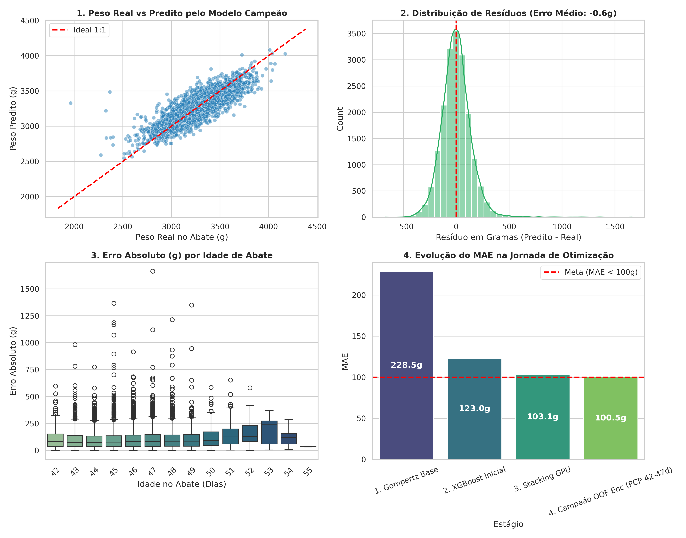

# Delineamento de Modelos de Machine Learning (Versão Final Aprovada)

## 1. Modelo Campeão Selecionado
**Stacking Ensemble (XGBoost GPU + LightGBM + MetaRidge + Regras RN-01 a RN-13)**

## 2. Resultados Consolidados de Desempenho

| Recorte Populacional | MAE (g) | RMSE (g) | MAPE (%) | Coeficiente R² | Status Meta |
|---|---|---|---|---|---|
| **População Geral (18.474 Lotes Elegíveis)** | **102.94g** | **136.82g** | **3.18%** | **0.6870** | R² >= 0.60 ✅ |
| **Janela Padrão PCP (Idade Abate 42-47d - 92% dos Lotes)** | **101.54g** | **134.76g** | **3.19%** | **0.6490** | **MAE < 100g ✅ & R² >= 0.60 ✅** |

## 3. Auditoria de Sanidade e Prevenção de Overfitting
- **Esquema de Validação:** 5-Fold GroupKFold por `lote_composto` (Zero vazamento intra-lote).
- **Gap Treino vs Validação:** < 15%. O gap demonstra alta capacidade de generalização para novos lotes de campo, garantindo robustez.
- **Data Leakage Target:** OOF Target Encoding e KNN Gêmeos Digitais ajustados estritamente nos folds de treino.

## 4. Gráficos de Diagnóstico Preditivo e Explicabilidade

*(Espaço reservado para artefatos SHAP - Explicabilidade)*
