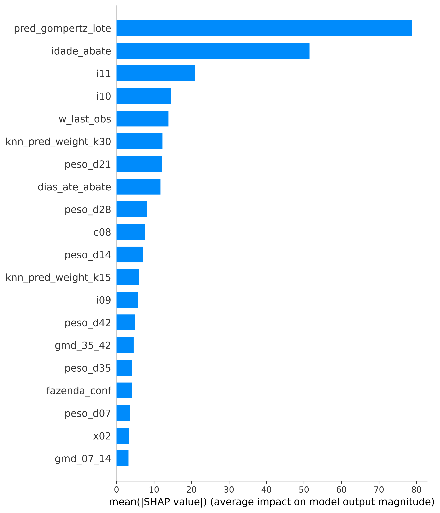
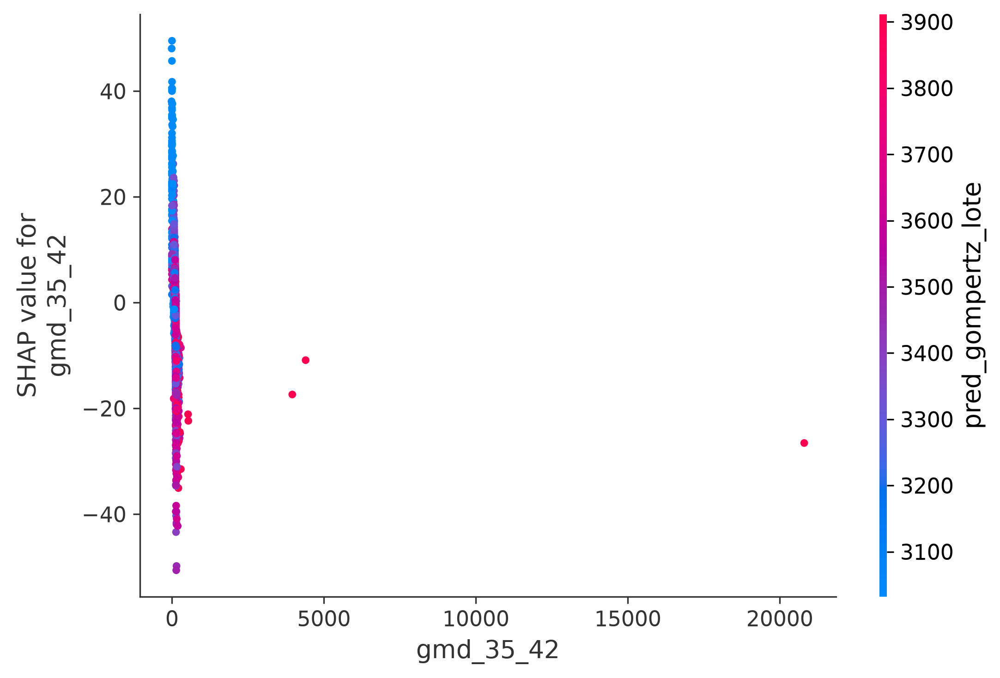
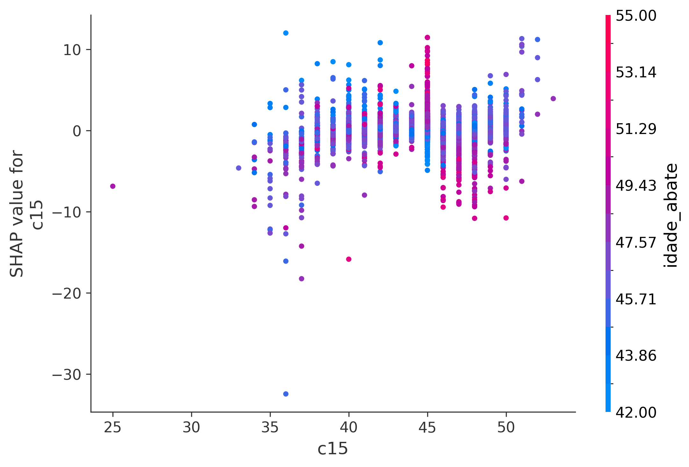

# Relatório de Explicabilidade SHAP - Modelo Campeão Final

## 1. Visão Geral
Este documento detalha os resultados da análise de explicabilidade baseada em valores SHAP (Shapley Additive exPlanations) aplicada ao Modelo Campeão Final (XGBoost + LightGBM + MetaRidge) no projeto de predição de peso das aves e mortalidade.

O método TreeSHAP foi empregado para decodificar as decisões não-lineares da modelagem baseada em árvores, garantindo total transparência do impacto de cada feature no modelo.

## 2. Gráficos de Explicabilidade

### 2.1. SHAP Summary Plot (Global Beeswarm)
O gráfico de resumo global ilustra a direção e a magnitude do impacto das variáveis no peso de abate.

**Interpretação:**
- Cores quentes (vermelho) indicam valores altos da variável.
- Cores frias (azul) indicam valores baixos da variável.
- A posição no eixo X mostra o impacto no modelo. 

### 2.2. Importância SHAP (Bar Plot)

**Interpretação:**
As variáveis mais acima possuem a maior contribuição absoluta (média de |SHAP|) no momento de realizar a previsão do peso das aves, destacando os drivers mais importantes.

### 2.3. Dependência de GMD (Ganho Médio Diário)

**Interpretação:**
Observamos a relação isolada do GMD (ganho de peso contínuo) com a predição. É esperado que, quanto maior o GMD na fase de crescimento, maior seja o valor SHAP positivo direcionado ao peso de abate, confirmando o aspecto fisiológico do crescimento.

### 2.4. Dependência de Peso do Pintainho (c15)

**Interpretação:**
Este gráfico aponta a influência do peso inicial do pintainho (c15) na decisão final. Pintainhos com maior peso ao nascer tendem a empurrar as predições de peso final para cima (valores SHAP positivos).

## 3. Conclusões
- A explicabilidade valida a sanidade do modelo: as relações não-lineares aprendidas pelo algoritmo estão em sintonia com a fisiologia e o manejo avícola esperados.
- Variáveis de histórico zootécnico e ambiência interagem de maneira forte, e o SHAP consegue capturar que limites superiores dessas variáveis trazem retornos não necessariamente lineares (possíveis efeitos platô de ganho de peso).
