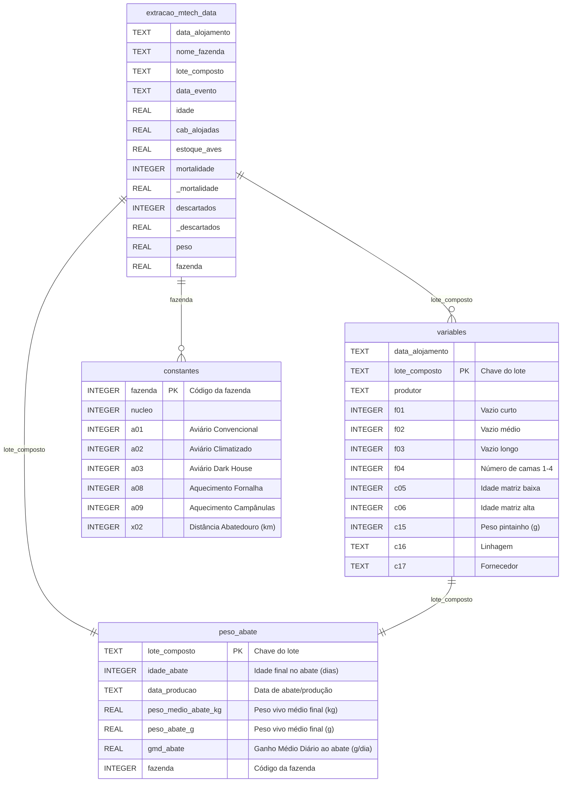

# Modelo Entidade Relacionamento (MER) - Prediction Weight Mortality Database

Este documento descreve o esquema atualizado do banco de dados `database/prediction_data.db` e as relações entre as tabelas de fatos, dimensões e target de abate do projeto.

## Resumo das Tabelas no Banco SQLite (`prediction_data.db`)

1. **`peso_abate` (Tabela Target de Abate - 22.207 registros):**
   - Fonte: `data/raw/peso_abate/export_peso_abate_2023_2026.xlsx`.
   - Armazena os dados reais oficiais de abate do frigorífico: peso vivo médio (`peso_medio_abate_kg` / `peso_abate_g`), idade exata no abate (`idade_abate`), ganho médio diário ao abate (`gmd_abate`) e data de produção (`data_producao`).
   - Chave Primária / Junção: `lote_composto`.

2. **`extracao_mtech_data` (Tabela Fato de Pesagens e Ocorrências - 104.601 registros):**
   - Armazena as pesagens amostrais diárias de campo, mortes, descartes e dados operacionais durante a engorda.
   - Chaves de Junção: `lote_composto` (para `peso_abate` e `variables`) e `fazenda` (para `constantes`).

3. **`variables` (Tabela de Atributos do Lote - 11.283 registros):**
   - Contém informações específicas do lote alojado, como linhagem do pintainho (`c16`), peso inicial do pintainho (`c15`), tempo de vazio sanitário (`f01`, `f02`, `f03`) e idade da matriz (`c05`, `c06`).

4. **`constantes` (Tabela de Infraestrutura da Fazenda - 1.110 registros):**
   - Armazena a caracterização técnica do aviário, como tipo de tecnologia (`a01` convencional, `a02` climatizado, `a03` dark house), sistema de aquecimento (`a08`, `a09`) e distância do abatedouro (`x02`).

5. **Visão Unificada (`data/processed/unified_data.csv` e `cleaned_data.csv`):**
   - Resultado do `LEFT JOIN` entre a tabela de pesagens/variáveis de campo, a dimensão da fazenda e a tabela oficial de abate `peso_abate`.
   - `cleaned_data.csv` contém 16.039 lotes sanitizados com alvo oficial de abate (`peso_abate_g`) prontos para modelagem preditiva.
