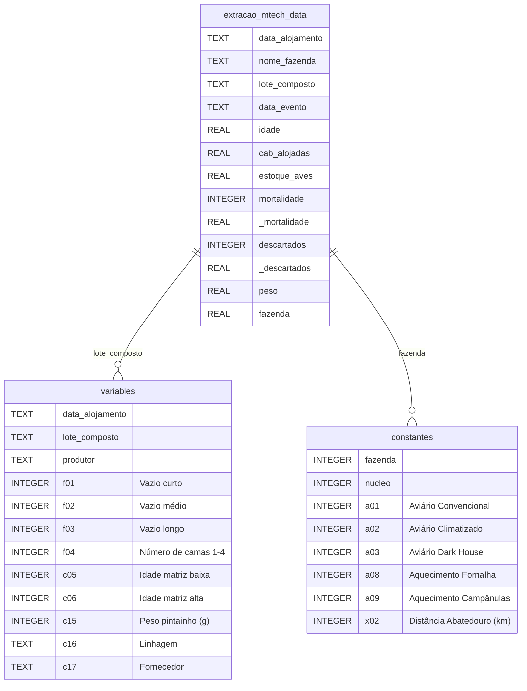

# Modelo Entidade Relacionamento (MER) - Prediction Weight Mortality Database

Este documento descreve o esquema do banco de dados `database/prediction_data.db` e as relações entre as tabelas de fatos e dimensões do projeto.

## Resumo das Tabelas no Banco SQLite (`prediction_data.db`)

1. **`extracao_mtech_data` (Tabela Fato - 104.601 registros):**
   - Armazena as pesagens diárias, mortes, descartes e dados operacionais de campo.
   - Chaves de Junção: `lote_composto` (para a tabela `variables`) e `fazenda` (para a tabela `constantes`).

2. **`variables` (Tabela de Atributos do Lote - 11.283 registros):**
   - Contém informações específicas do lote alojado, como linhagem do pintainho (`c16`), peso inicial do pintainho (`c15`), tempo de vazio sanitário (`f01`, `f02`, `f03`) e idade da matriz (`c05`, `c06`).

3. **`constantes` (Tabela de Infraestrutura da Fazenda - 1.110 registros):**
   - Armazena a caracterização técnica do aviário, como tipo de tecnologia (`a01` convencional, `a02` climatizado, `a03` dark house), sistema de aquecimento (`a08`, `a09`) e distância do abatedouro (`x02`).

4. **Visão Unificada (`data/processed/unified_data.csv` e `cleaned_data.csv`):**
   - Resultado do `LEFT JOIN` entre a tabela fato e as dimensões via `lote_composto` e `fazenda`, contendo 68 colunas e 88.021 observações limpas prontas para modelagem.
