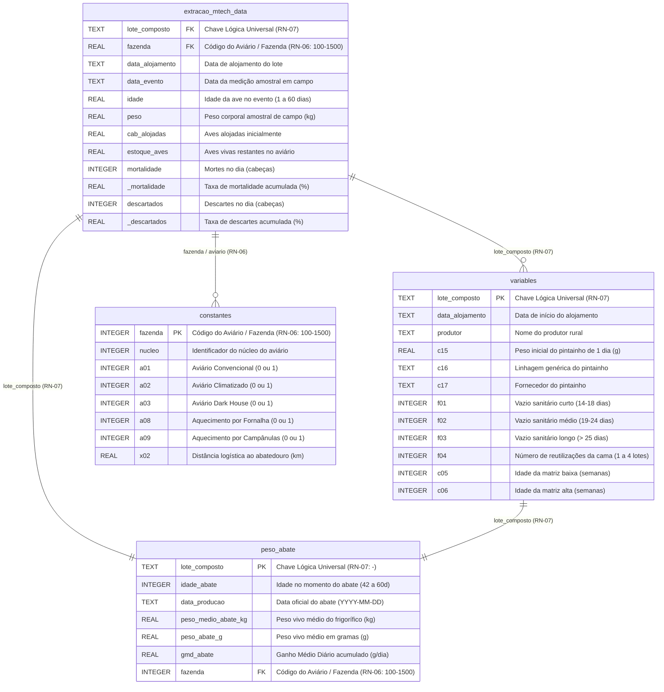

# Modelo Entidade-Relacionamento (MER / DER) - Predição de Peso e Mortalidade

Este documento define formalmente o **Modelo Entidade-Relacionamento (MER/DER)** do banco de dados relacional [prediction_data.db](file:///home/brunoconter/Documentos/1_C.VALE/1%20-%20ANALISES/10%20-%20PESO%20DAS%20AVES/prediction_weight_mortality/database/prediction_data.db), incorporando integralmente as Regras de Negócio **RN-06 (Aviário / Fazenda)** e **RN-07 (Composição do Lote Composto)**.

---

## 📐 1. Regras Estruturais de Identificação (RN-06 e RN-07)

| Regra de Negócio | Entidade / Atributo | Sintaxe / Padrão de Formatação | Definição Zootécnica e Estrutural |
|---|---|---|---|
| **RN-06: Aviário / Fazenda** | `aviario` / `fazenda` | **$100 \le \text{aviario} \le 1500$** (Inteiro) | O termo **Aviário** é sinônimo de **Fazenda** nos datasets. Identifica a propriedade/unidade física de produção (número inteiro entre 100 e 1500). |
| **RN-07: Lote Composto** | `lote_composto` / `LoteComposto` | Padrão 1: `<aviario>-<lote>` Padrão 2: `<aviario>-<lote>-<nucleo>` | Chave universal de junção entre tabelas. Formada pela concatenação do aviário e número do lote (ex: `1223-8`), podendo incluir a identificação do núcleo (ex: `1223-8-1`). |

---

## 📊 2. Diagrama Entidade-Relacionamento (DER - Mermaid)

---

## 🗄️ 3. Resumo das Tabelas e Cardinalidade no Banco SQLite (`prediction_data.db`)

1. **`peso_abate` (Tabela Target de Abate Oficial - 22.207 registros):**
   - **Origem:** `data/raw/peso_abate/export_peso_abate_2023_2026.xlsx`.
   - Contém a variável alvo oficial do abatedouro (`peso_medio_abate_kg`, `peso_abate_g` e `gmd_abate`).
   - **Chave Primária:** `lote_composto` (conforme **RN-07**).
   - **Chave Estrangeira:** `fazenda` (conforme **RN-06**).

2. **`extracao_mtech_data` (Tabela Fato de Pesagens e Ocorrências - 147.816 registros):**
   - **Origem:** `data/raw/extracao_mtech/Campo_Lote_Semanal_*.xlsx` (27 arquivos de extração).
   - Contém os acompanhamentos amostrais diários/semanais de peso corporal, mortalidade acumulada, descartes e aves vivas.
   - **Chaves de Junção:** `lote_composto` (**RN-07**) e `fazenda` (**RN-06**).

3. **`variables` (Dimensão do Lote Alojado - 11.283 registros):**
   - **Origem:** `data/raw/features/BANCO_VARIAVEIS.xlsx` (Aba `VARIABLES`).
   - Armazena as características iniciais zootécnicas do lote (peso do pintainho `c15`, linhagem `c16`, fornecedor `c17`, vazio sanitário `f01`-`f03` e cama `f04`-`f06`).
   - **Chave Primária:** `lote_composto` (**RN-07**).

4. **`constantes` (Dimensão da Infraestrutura do Aviário - 1.110 registros):**
   - **Origem:** `data/raw/features/BANCO_VARIAVEIS.xlsx` (Aba `CONSTANTES`).
   - Armazena os atributos físicos e tecnológicos do aviário (`a01`-`a03`), aquecimento (`a08`-`a09`) e distância ao abatedouro (`x02`).
   - **Chave Primária:** `fazenda` (**RN-06**).

5. **Visões Processadas (`data/processed/unified_data.csv` e `cleaned_data.csv`):**
   - **`unified_data.csv` (147.816 registros):** Tabela unificada completa com cruzamento das 4 fontes relacionais.
   - **`cleaned_data.csv` (22.038 lotes únicos):** Dataset sanitizado com filtros biológicos (RN-01 a RN-05) pronto para modelagem preditiva de abate.
