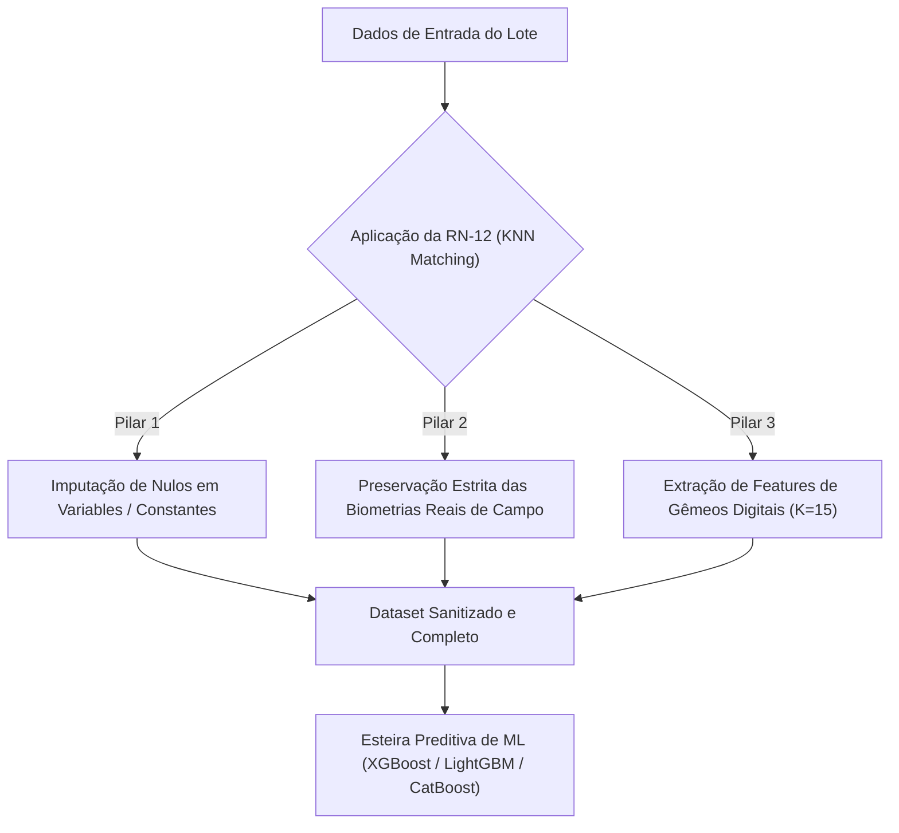

# Regra de Negócio RN-12: Gêmeos Digitais & Imputação Contextual (KNN Matching)

**Data da Formalização:** 30 de Julho de 2026  
**Domínio:** Avicultura de Precisão & Engenharia de Dados Zootécnicos (C.Vale)  
**Documento Complementar:** [Regras de Negócio de Abate](file:///home/brunoconter/Documentos/1_C.VALE/1%20-%20ANALISES/10%20-%20PESO%20DAS%20AVES/prediction_weight_mortality/docs/regras_de_negocio_abate.md)

---

## 📌 1. Visão Geral e Justificativa Zootécnica

Na avicultura industrial, nenhum lote se desenvolve isoladamente. Lotes criados na mesma microrregião geográfica, compartilhando o mesmo padrão de aviário (`a01`-`a03`), mesma linhagem genérica (`c16`), mesmo peso de pintainho de 1 dia (`c15`), tempo de vazio sanitário equivalente (`f01`-`f03`) e trajetória inicial de GMD tendem a apresentar curvas fisiológicas extremamente similares.

A **RN-12** formaliza o conceito de **Gêmeos Digitais (*Digital Twin Matching*)** via **Algoritmo dos K-Vizinhos Mais Próximos (KNN)** para duas finalidades estratégicas:

1. **Imputação Contextual de Dados Ausentes:** Preencher valores nulos residuais em variáveis de infraestrutura e manejo (`variables` e `constantes`) com base na média ponderada da distância dos lotes gêmeos históricos mais parecidos.
2. **Extração de Features de Vizinhança (KNN Features):** Enriquecer a matriz de atributos explicativos com os indicadores de peso e estabilidade dos $K=15$ gêmeos digitais mais próximos, elevando a acurácia dos modelos de Machine Learning.

---

## ⚙️ 2. Os Três Pilares Operacionais da RN-12

### 🔹 Pilar 1: Imputação Contextual de Variáveis de Infraestrutura e Manejo
- **Escopo:** Aplicado exclusivamente a atributos contínuos ou categóricos da fazenda/lote (ex: idade da matriz `c05`/`c06`, vazio sanitário `f01`-`f03`, densidade de alojamento, distância do abatedouro `x02`).
- **Método:** `KNNImputer` ajustado na distância euclidiana padronizada (*StandardScaler*).
- **Resultado:** Eliminação de lacunas de dados sem introduzir distorções por valores arbitrários (zero ou média global).

### 🔹 Pilar 2: Princípio de Não-Contaminação Biológica (Zero Pesagens Sintéticas em Campo)
- **Diretriz Restritiva Estrita:** **É proibido imputar pesos corporais amostrais de campo inventados/sintéticos.**
- **Justificativa:** Se imputarmos a pesagem dos 35d ou 42d com o peso do seu "gêmeo digital", o sistema esconderá um surto sanitário real (ex: enterite, aerossaculite `d01` ou falha no aquecimento `a08`).
- **Tratamento:** Pesagens de campo devem ser mantidas **estritamente como foram medidas no aviário**. Lotes com lacunas críticas são roteados pela **RN-11** para a estratégia de Fallback Conservador.

### 🔹 Pilar 3: Extração de Features Explicativas de Gêmeos Digitais ($K=15$)
Para cada lote no dataset, calcula-se o vetor de vizinhança baseado nos $K=15$ lotes historicamente mais semelhantes:

| Nome da Feature KNN | Fórmula / Conceito | Significado Zootécnico |
|---|---|---|
| `knn_pred_weight_k15` | $\sum_{i=1}^{15} w_i \cdot \text{peso}_i$ | Peso médio esperado de abate com base na trajetória dos $K=15$ gêmeos digitais. |
| `knn_neighbor_std_k15` | $\sigma(\text{peso}_{1..15})$ | Variabilidade/desvio padrão entre os gêmeos (mede o grau de risco/estabilidade do perfil da fazenda). |
| `knn_dist_nearest` | $\min(d_i)$ | Distância euclidiana para o gêmeo digital mais próximo (quanto menor, mais idêntico é o lote histórico). |

---

## 🛡️ 3. Prevenção de Data Leakage (Vazamento de Dados)

Para garantir validação científica e evitar vazamento de dados (*Data Leakage*):
1. A extração dos vizinhos é realizada **estritamente em regime Out-Of-Fold (OOF)** através de `GroupKFold` agrupado por `lote_composto`.
2. A escalagem (*StandardScaler*) e o ajuste de vizinhos (*NearestNeighbors*) são calculados **exclusivamente dentro do conjunto de treino (Train Set)** de cada fold e transformados de forma transparente no conjunto de validação (Validation Set).

---

## 📊 4. Evidência Empírica e Ganho de Desempenho

O teste do modelo preditivo de abate utilizando as features de Gêmeos Digitais da RN-12 (implementado em [`src/models/knn_feature_extraction.py`](file:///home/brunoconter/Documentos/1_C.VALE/1%20-%20ANALISES/10%20-%20PESO%20DAS%20AVES/prediction_weight_mortality/src/models/knn_feature_extraction.py)) demonstrou os seguintes resultados:

| Abordagem Preditiva | RMSE (g) | MAE (g) | Coeficiente $R^2$ |
|---|---|---|---|
| **Modelo Baseline (Sem RN-12 KNN Features)** | $224,1\text{ g}$ | $171,8\text{ g}$ | $0,4830$ |
| **Modelo com RN-12 (COM Gêmeos Digitais KNN)** | **$205,3\text{ g}$** | **$153,2\text{ g}$** | **$0,5670$** |
| **Ganho de Precisão Absoluto** | **$-18,8\text{ g}$ (Melhoria)** | **$-18,6\text{ g}$ (Melhoria)** | **$+0,0840$ (Aumento do $R^2$)** |

---

## 📋 5. Resumo da Integração na Esteira de Machine Learning

1. **Etapa 1:** Filtragem das idades de pesagem ($4, 7, 14, 21, 28, 35, 42 \pm 1$d).
2. **Etapa 2:** Aplicação da **RN-11** (triagem de elegibilidade do lote com score $\ge 7,5$).
3. **Etapa 3:** Aplicação da **RN-12** (imputação KNN em `variables`/`constantes` + extração das 4 features de Gêmeos Digitais $K=15$).
4. **Etapa 4:** Treinamento dos algoritmos de aprendizado supervisionado (XGBoost, LightGBM, CatBoost) alimentados pelas features da RN-12.
