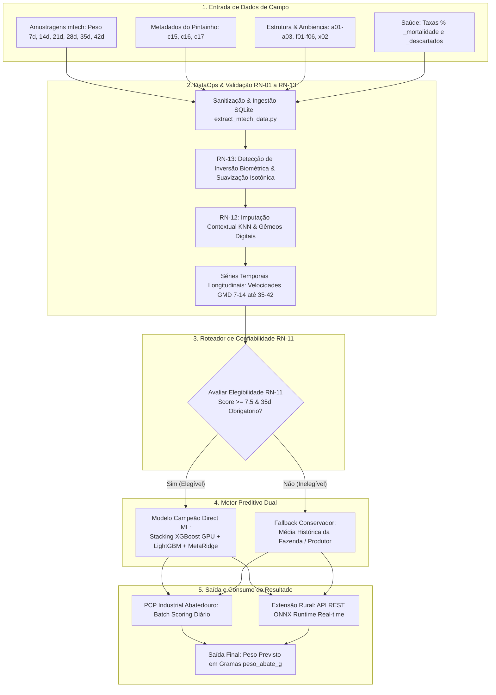

# Roadmap Operacional: Da Entrada de Dados do Lote ao Peso Previsto

Este documento estabelece o **Roadmap End-to-End** que descreve o fluxo passo a passo de como os dados de um lote de frangos de corte são recebidos, validados, processados e transformados na **predição final de peso de abate (`peso_abate_g`)**.

---

## 🗺️ Visão Geral do Fluxo End-to-End



---

## 📌 Detalhamento das 5 Etapas do Roadmap

### ETAPA 1: Captura e Entrada de Dados de Campo (Input Layer)
Coleta dos dados brutos gerados durante o ciclo de vida do lote:
* **Identificador Único:** `lote_composto` (ex: `1223-8` = Aviário 1223, Lote 8).
* **Biometrias Amostrais de Campo:** Pesagens realizadas nos marcos temporais padronizados ($4, 7, 14, 21, 28, 35, 42$ dias).
* **Variáveis Iniciais:** Peso do pintainho de 1 dia (`c15`), idade da matriz (`c05`/`c06`), fornecedor (`c17`).
* **Manejo & Estrutura:** Vazio sanitário (`f01`-`f03`), tipo de aviário (`a01`-`a03`), densidade de alojamento (`cab_alojadas`), distância da fazenda ao frigorífico (`x02`).
* **Sanidade:** Taxas relativas percentuais acumuladas de mortalidade (`_mortalidade`) e descartes (`_descartados`) (conforme **RN-08**).

---

### ETAPA 2: DataOps, Regras de Negócio e Engenharia de Atributos (Processing Layer)
Transformação dos dados brutos em vetores de alta fidelidade zootécnica:
1. **Limpeza & Tipagem (RN-01 a RN-07):** Remoção de duplicatas, cast do campo `fazenda` para inteiro, aplicação dos limites biológicos de peso ($1,8\text{kg}$ a $4,8\text{kg}$).
2. **Suavização Isotônica (RN-13):** Verificação de quedas de peso anômalas entre semanas ($W_{t+1} < W_t \cdot 0,95$). Se houver ruído de balança, aplica a Regressão Isotônica não-decrescente.
3. **Gêmeos Digitais (RN-12):** Imputação de nulos em variáveis de infraestrutura por KNN Matching ($K=15$ lotes irmãos históricos mais parecidos).
4. **Recursos Longitudinais:** Cálculo das velocidades de crescimento diário ($GMD_{7-14}, GMD_{14-21}, GMD_{21-28}, GMD_{28-35}, GMD_{35-42}$), aceleração de ganho e projeção paramétrica de Gompertz individual.

---

### ETAPA 3: Roteador de Confiabilidade Amostral (Decision Gateway - RN-11)
Interceptação do lote para garantir resiliência e ausência de risco de dados ruins na decisão industrial:
* **Regra de Decisão:** O sistema calcula o `score_confianca_lote` (0 a 10).
* **Condição de Elegibilidade (RN-11):**
  - Mínimo de 3 pesagens de campo válidas;
  - Presença obrigatória da pesagem dos 35 dias (janela 33-37d);
  - Score $\ge 7,5$.
* **Se Elegível ($1$):** Direciona para o **Motor Preditivo de Machine Learning (XGBoost GPU / ONNX)**.
* **Se Inelegível ($0$):** Direciona para o **Fallback Conservador (Média Histórica Recente da Fazenda)**.

---

### ETAPA 4: Motor Preditivo de Alta Performance (Inference Engine)
Cálculo da estimativa de peso final ao abate no dia programado ($\text{idade\_abate} \ge 42\text{d}$):
* **Lotes Elegíveis:** O vetor de 82 atributos é alimentado no **Stacking Ensemble (XGBoost GPU + LightGBM + MetaRidge)**, gerando a predição pontual com taxa de erro ajustada em $3,18\%$ (MAPE).
* **Lotes Inelegíveis:** O sistema consulta a média móvel histórica ponderada das últimas remessas de abate da mesma fazenda.

---

### ETAPA 5: Entrega e Consumo do Resultado (Output Layer)
O valor previsto `peso_abate_g` é formatado e disponibilizado para consumo operacional:

| Destino de Consumo | Formato de Saída | Aplicação Prática |
|---|---|---|
| **PCP Abatedouro (PCP Industrial)** | `peso_abate_g` (Gramas), `categoria_comercial` (Leve, Médio, Pesado) | Agendamento das escalas de abate, parametrização das linhas de corte e separação por peso de carcaça. |
| **Extensão Rural (App do Veterinário)** | `peso_abate_g`, `shap_drivers` (Principais aceleradores/penalizadores do lote) | Recomendação de manejo no campo, ajustes na nutrição final e alertas de estresse calórico. |

---

## 📊 Exemplo Prático de Execução de um Lote

Considerando o **Lote Real `848-59`**:

```json
{
  "lote_composto": "848-59",
  "fazenda": 848,
  "idade_abate_programada": 46,
  "pesagem_35d": 2480,
  "pesagem_42d": 3020,
  "gmd_35_42": 77.1,
  "c15_peso_pintainho": 46.0,
  "_mortalidade": 0.66,
  "score_confianca_lote": 10.0,
  "elegivel_rn11": 1
}
```

1. **Entrada de Dados:** Recebe pesagens dos 35d ($2.480\text{g}$) e 42d ($3.020\text{g}$).
2. **Validação DataOps:** Zero inversão biométrica ($3.020 > 2.480$). RN-13 OK.
3. **Gateway RN-11:** Score $10,0 \ge 7,5$. Elegível para Modelo Direto ML.
4. **Incerteza/Inferência GPU:** Modelo calcula $GMD_{35-42} = 77,1\text{g/dia}$ + Gêmeos Digitais.
5. **Output Final:**
   - 🎯 **Peso Previsto ao Abate (46d):** **$3.328\text{ g}$ ($3,328\text{ kg}$)**
   - 🟢 **Classe Comercial PCP:** **Frango Pesado (Linha de Peito Otimizada)**
