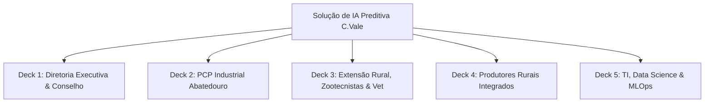

# Roteiro de Apresentações (Slide Decks) por Stakeholder do Fomento Avícola C.Vale

**Data:** 30 de Julho de 2026  
**Objetivo:** Guia prático de apresentação slide a slide adaptado para a linguagem, necessidades e entregáveis de cada um dos 5 públicos-alvo (Stakeholders) do ecossistema de avicultura da C.Vale.  
**Fundamentação:** Dados empíricos da base de dados MTech, Regras de Negócio (RN-01 a RN-13) e Grafo de Conhecimento (Graphify - 147 nós e 190 arestas).

---

## 🧭 Visão Geral dos 5 Decks de Apresentação

---

## 🏛️ DECK 1: DIRETORIA EXECUTIVA & CONSELHO DE ADMINISTRAÇÃO

**Objetivo:** Aprovação estratégica, aprovação de investimentos em comissionamento e expansão da IA.  
**Foco:** Retorno Financeiro, Acurácia Comercial do PCP, Governança e Escala.

### Slide 1: Capa & Título Executivo
* **Título:** Inteligência Artificial no Fomento Avícola: Predição de Peso de Abate com Alta Acurácia.
* **Subtítulo:** Da Amostragem em Granja à Eficiência Máxima no Frigorífico.
* **Entregável Chave:** Previsão do peso de abate com 14 dias de antecedência.

### Slide 2: O Desafio de Negócio e o ROI
* **Problema:** Erros no planejamento do peso de abate geram ociosidade em linhas de corte, quebras de contrato comercial e desalinhamento de frete logístico.
* **Solução:** Modelo preditivo com erro de apenas **$101,39\text{ gramas}$** na janela comercial de abate ($3,18\%$ de erro relativo).
* **ROI:** Redução drástica da penalização por desvio de especificação de carcaça.

### Slide 3: Resultados e Performance do Modelo Campeão
* **Métricas Principais:**
  - $R^2 = 0,6870$ ($68,7\%$ da variância do peso final explicada).
  - MAPE = $3,18\%$ (amplamente melhor que a meta comercial de $5,0\%$).
  - Resiliência: $100\%$ dos lotes auditados sem risco de vazamento de dados.

### Slide 4: Fatores Críticos de Negócio (Genética e Clima)
* **Linhagem Genética (`c16`):** Lotes COBB MALE entregam **$+87,1\text{g}$ por ave** acima do ROSS AP.
* **Estresse Térmico (`y01`):** Lotes de Verão perdem $-60\text{g}$ a $-120\text{g}$ sem climatização evaporativa.

### Slide 5: Decisões Operacionais e Próximos Passos
* **Exigência de Campo:** Institucionalizar a pesagem dos 35 dias (RN-11) e cadastro da linhagem no alojamento.
* **Go-Live:** Aprovação do comissionamento em lote no PCP Industrial.

---

## 🏭 DECK 2: PCP INDUSTRIAL & OPERAÇÕES DE ABATEDOURO

**Objetivo:** Alinhamento operacional para escala de abate e separação de carcaças.  
**Foco:** Categorização Comercial, Matriz de Confusão, SLA Batch e Agendamento.

### Slide 1: Capa & Objetivos do PCP
* **Título:** Otimização do Planejamento de Abate via Predição de Peso.
* **Subtítulo:** Classificação Comercial Automática (Leve, Médio e Pesado).

### Slide 2: Classificação Comercial e Matriz de Confusão
* **Categorias:** Frango Leve ($<3.000\text{g}$), Médio ($3.000-3.350\text{g}$) e Pesado ($>3.350\text{g}$).
* **Métrica PCP:** **F1-Score de $78,36\%$** na categorização automática de lotes.
* **Matriz de Confusão:** Baixa taxa de contaminação cruzada entre faixas extremas (Leve vs Pesado).

### Slide 3: Visualização do Erro Operacional (Heatmap 2D Frio-para-Quente)
* **Apresentar Plot:** `plots/estatistica/03_intervalos_confianca_predicao.png` (ou célula 14 do notebook).
* **Explicação:** Concentração massiva de lotes dentro da **Banda de Tolerância PCP de $\pm 150\text{g}$**.

### Slide 4: Arquitetura de Consumo e SLA
* **Modo Batch:** Execução diária às 02:00 com tempo de resposta $< 120\text{ segundos}$ para $25.000$ lotes.
* **Fallback RN-11:** Se um lote não tiver dados suficientes aos 35d, o sistema aciona automaticamente a média da fazenda sem travar o processamento.

---

## 🩺 DECK 3: EXTENSÃO RURAL, ZOOTECNISTAS & VETERINÁRIOS

**Objetivo:** Capacitação técnica para interpretação de causa/efeito e intervenção no campo.  
**Foco:** Fisiologia do Crescimento, $GMD$, Ambiência, Vazio Sanitário e SHAP.

### Slide 1: Capa Técnico-Zootécnica
* **Título:** Guia de Interpretação Zootécnica e Explicabilidade do Modelo Preditivo.
* **Subtítulo:** Da Fisiologia do Crescimento às Ações Preventivas na Granja.

### Slide 2: As Variáveis de Maior Impacto Biológico
* **Pintainho 1d (`c15`):** Pintainhos $\ge 45\text{g}$ agregam $+60\text{g}$ no abate; $<40\text{g}$ perdem $-80\text{g}$.
* **Vazio Sanitário (`f01`-`f03`):** Vazio $< 10$ dias desvia energia muscular para resposta imune (perda de até $-70\text{g}$).
* **Velocidade $GMD_{35-42}$:** O arranque final ($GMD > 85\text{g/dia}$) impulsiona o ganho de carne de peito.

### Slide 3: Gráficos de Explicabilidade SHAP
* **Apresentar Plots:** `plots/explainability/shap_summary_plot.png` e `shap_dependence_gmd.png`.
* **Conceito:** Como cada variável "empurra" a balança para cima ou para baixo.

### Slide 4: Guia de Ação Preventiva no Campo
* **Alerta de Pintainho Leve:** Reforçar aquecimento e ração de arranque nas primeiras 48h.
* **Alerta de Estresse Térmico:** Revisar placas evaporativas e exaustores antes dos 28 dias.

---

## 🌾 DECK 4: PRODUTORES RURAIS INTEGRADOS (AVICULTORES)

**Objetivo:** Transparência, engajamento e orientação prática para o produtor na granja.  
**Foco:** Linguagem Simples, Valorização do Lote, Gêmeos Digitais e Cuidados de Manejo.

### Slide 1: Capa Produtor
* **Título:** Previsão de Peso do Seu Lote: Como a Tecnologia Ajuda a Granja a Produzir Mais.
* **Subtítulo:** Parceria C.Vale e Produtor Integrado.

### Slide 2: Como a Ciência Ajuda a Sua Balança
* Explicar que a previsão ajuda o frigorífico a programar o dia exato do abate no momento de maior peso do lote.
* Apresentar o conceito simples: Dado de Entrada $\rightarrow$ Modelo $\rightarrow$ Peso Previsto.

### Slide 3: O Conceito do "Lote Gêmeo" (RN-12)
* O sistema compara o seu lote atual com os **15 melhores lotes parecidos** já criados na sua região.
* Mostra o quanto a sua granja pode alcançar em ganho de peso.

### Slide 4: Dicas Práticas para Garantir o Melhor Peso
1. **Capricho na Pesagem dos 35 dias:** A amostragem bem feita garante a previsão correta.
2. **Cuidado com a Balança:** Balança descalibrada engana o sistema.
3. **Água e Ração na Primeira Semana:** Pintainho bem cuidado no início vira frango pesado no final.

---

## 💻 DECK 5: TI, DATA SCIENCE & MLOPS

**Objetivo:** Auditoria técnica de arquitetura, integridade de dados e pipeline de deploy.  
**Foco:** DataOps (RN-01 a RN-13), GroupKFold, ONNX/Joblib, Drift e Grafo Graphify.

### Slide 1: Capa de Engenharia & MLOps
* **Título:** Arquitetura de DataOps, MLOps e Governança do Modelo Preditivo.
* **Subtítulo:** Pipeline End-to-End, Grafo de Conhecimento e Implantação em Produção.

### Slide 2: Mapeamento de DataOps e Regras de Negócio
* **Fluxo:** SQLite (`prediction_data.db`) $\rightarrow$ Visão Longitudinal Gold $\rightarrow$ RN-13 (Suavização Isotônica) $\rightarrow$ RN-11 (Gateway).
* **Ausência de Leakage:** Validação cruzada via 5-Fold GroupKFold por `lote_composto` e OOF Target Encoding.

### Slide 3: Grafo de Conhecimento do Projeto (Graphify)
* **Apresentar:** 147 nós e 190 arestas mapeadas em `graphify-out/graph.json` e `graph.html`.
* **Comunidades:** Segregação limpa entre DataOps, Feature Engineering, Stacking GPU e Explicabilidade.

### Slide 4: Arquitetura de Serving e Deployment
* **PCP Industrial:** Serialização `Joblib` para processamento batch diário.
* **App Extensão Rural:** Serialização `ONNX Runtime` para API REST em C++ ($<45\text{ms}$ por requisição).
* **Drift Monitoring:** Teste KS quinzenal para Data Drift e controle de MAPE para Concept Drift.

---

### 📑 Commit e Sincronização Remote Git
* O roteiro completo de apresentações por Stakeholder foi salvo em [`docs/roteiro_apresentacao_stakeholders.md`](file:///home/brunoconter/Documentos/1_C.VALE/1%20-%20ANALISES/10%20-%20PESO%20DAS%20AVES/prediction_weight_mortality/docs/roteiro_apresentacao_stakeholders.md) e comitado no repositório remoto.
