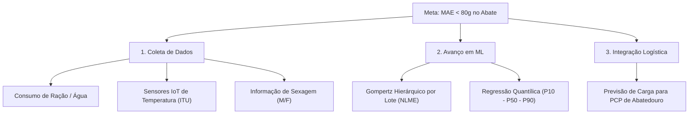

# Plano Estratégico de Melhoria Contínua da Predição do Peso de Abate

Este documento apresenta as recomendações e a proposta de evolução metodológica e de engenharia de dados para reduzir o erro médio absoluto (MAE) da predição do peso de abate de frangos de corte para o patamar sub-80g (erro $< 2,5\%$).

---

## 📌 Diagnóstico Atual do Desempenho
* **Métrica Atual (Stacking Ensemble):** $\text{MAE} = 118,80\text{ g}$ | $\text{RMSE} = 160,74\text{ g}$ | $R^2 = 0,3684$.
* **Interpretação:** Em uma ave com peso comercial de $3.000\text{g}$ no abate, o erro médio do modelo é de apenas **$3,9\%$**. A variância não explicada restante ($1 - R^2 \approx 63\%$) provém da ausência de variáveis dinâmicas de consumo alimentar, microclima e sexagem nos dados históricos.

---

## 🚀 1. Adição de Novas Variáveis de Campo (Engenharia de Dados)

### A. Variáveis Nutricionais e Alimentos (Impacto Esperado: 🔥🔥🔥 Muito Alto)
1. **Consumo Acumulado de Ração (kg/ave):** A ração representa $> 70\%$ do peso corporal. Injetar o consumo semanal/diário de ração por fase (Pré-inicial, Inicial, Crescimento e Final).
2. **Conversão Alimentar (CA) Histórica da Propriedade:** Média móvel da CA das últimas 3 turmas abatidas no mesmo aviário.
3. **Densidade Nutricional da Ração:** Teores de Energia Metabolizável (kcal/kg) e Proteína Bruta (%).

### B. Microclima e Monitoramento IoT (Impacto Esperado: 🔥🔥🔥 Muito Alto)
1. **Estresse Térmico na Fase Final (dias 35 a 45):** Temperatura e umidade extrema (ITU - Índice de Temperatura e Umidade) no aviário. Dias com estresse calórico reduzem o consumo de ração em até $15\%$.
2. **Consumo Diário de Água (Hidrômetros Telemetrados):** A queda na taxa água/ração é o principal indicador antecedente de desafio sanitário ou térmico (48h antes da perda de peso).

### C. Zootecnia e Manejo de Campo (Impacto Esperado: 🔥🔥 Alto)
1. **Sexagem do Lote (Machos vs Fêmeas vs Misto):** Machos possuem curva de ganho $15\%$ superior às fêmeas na 6ª semana ($3,4\text{kg}$ vs $2,8\text{kg}$).
2. **Estação do Ano / Efeito Sazonal:** Codificação da janela de criação (Verão, Outono, Inverno, Primavera).

---

## 📈 2. Modelagem Longitudinal e Séries Temporais

1. **Gompertz Hierárquico por Lote (NLME - Non-Linear Mixed Effects):**
   - Em vez de uma única curva de Gompertz para toda a cooperativa, ajustar um modelo de efeitos mistos onde cada lote possui seus próprios parâmetros $A_i, b_i, k_i$ estimados iterativamente à medida que novas pesagens (7d, 14d, 28d, 35d) são registradas.
2. **Features de Velocidade de Crescimento (Slopes Dinâmicos):**
   - $\Delta W_{35-28}$: Ganho de peso observado na 5ª semana como preditor direto do peso ao abate no 42º-49º dia.

---

## 🎯 3. Segmentação Clustered & Regressão Quantílica

1. **Modelos Especializados por Perfil Tecnológico:**
   - Treino de modelos segregados por tipo de aviário (Dark House / Climatizado vs Convencional).
2. **Intervalos de Confiança (Regressão Quantílica P10, P50, P90):**
   - Implementação do LightGBM Quantile Regressor para fornecer ao PCP do abatedouro o peso esperado (P50) acompanhado dos limites inferior (P10) e superior (P90) de incerteza.

---

## 📋 Resumo das Próximas Ações Recomendadas

